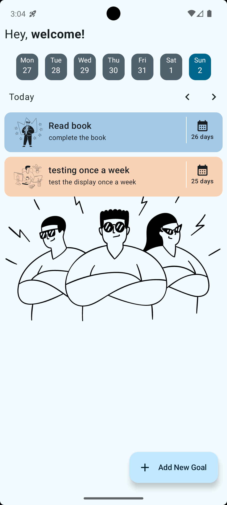
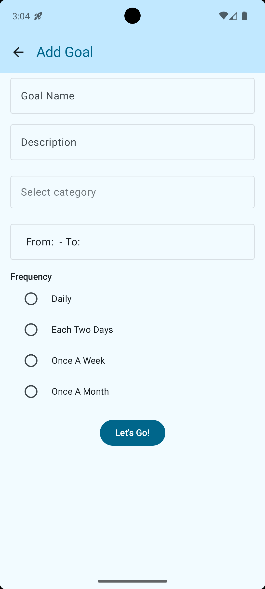
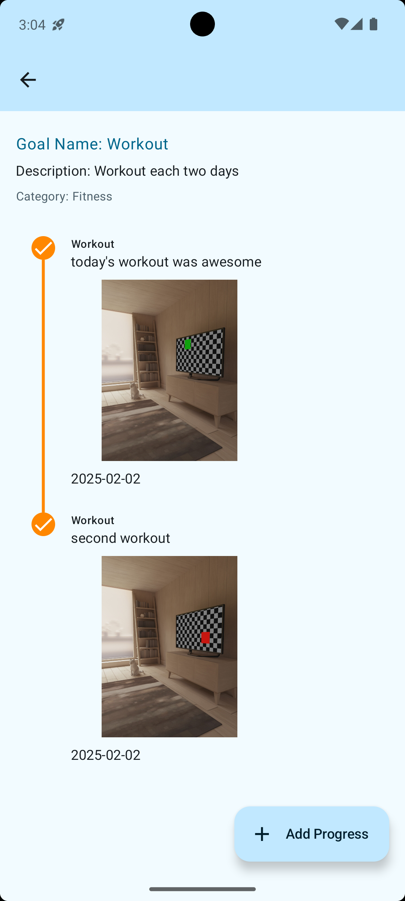

# Momentum

Momentum is a social photo-sharing app designed to help users set and track personal goals across different categories such as fitness, family, health, and more. The app encourages users to upload a daily proof photo to stay motivated and monitor their progress.

## App Flow & Demo

1. **Onboarding**: Users create their first goal by selecting a category, setting a duration, and adding details.
2. **Daily Interaction**: Users receive reminders to upload a photo as proof of progress.
3. **Goal Tracking**: Users can visualize their progress with a timeline of uploaded photos.
4. **Future Enhancements**: Community challenges, social interactions, and AI-based progress insights.

### Screenshots:

| Onboarding  | Home Screen | Goal Tracking | Add Goal |
|-------------|------------|---------------|----------|
|  |  |  |  |

---

## Technical Overview

The project is built using **Kotlin**, **Jetpack Compose**, and follows the **MVVM architecture pattern**. It is structured as a **multimodule project** and utilizes **Dagger Hilt** for dependency injection and **Room Database** for local data persistence.

### **Project Structure**

Momentum follows a **modular architecture** to improve scalability, maintainability, and separation of concerns.

#### **1. App Module**
- Contains the `MainActivity` and serves as the entry point of the application.

#### **2. Core Modules**
These modules provide shared utilities and functionalities used across the app.
- **common**: Common utilities and extensions.
- **database**: Contains database-related components like entities, DAOs, database instance, converters, and DI setup.
- **navigation**: Centralized navigation utilities.
- **network**: (Future use) Placeholder for API integration.
- **notification**: Manages alarms and notifications.
- **ui**: Reusable UI components and design elements.

#### **3. Feature Modules**
Each feature is encapsulated within its own module for better maintainability.
- **goal**: Handles goal creation, tracking, and progress logic (data, domain, and presentation layers).
- **home**: Manages the home screen UI and presentation logic.

---

## **Testing**
Due to time constraints, unit tests were primarily focused on:
- ViewModels
- Some use cases within the **goal** module.

---

## **Development Timeline**
This project was developed in **less than 30 hours** as part of a coding test for a job application. The entire idea, architecture, and implementation were designed and built by me.

---

## **Future Improvements**
- API integration for syncing goals across devices.
- Community-driven goal tracking and challenges.
- AI-driven progress insights and recommendations.

---

## **To Test the Notifications**
1. Open the app and create a new goal.
2. Set a duration and ensure notifications are enabled.
3. Wait for the daily reminder or trigger it manually via code. 

---

📽️ Demo:

  

